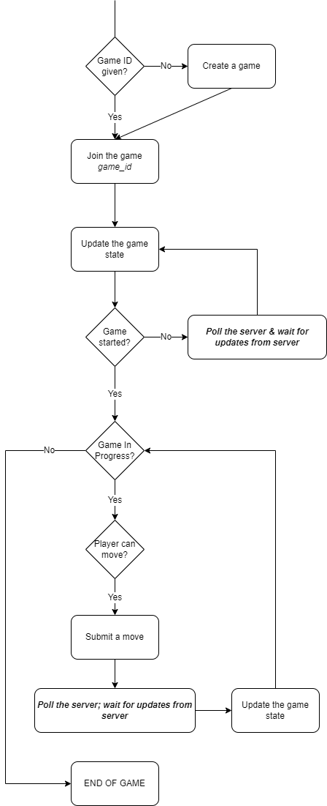

# Docs & Tutorial

This document presents an overview of how to use/create bots for our
game server with this repository. It will include a brief overview of the system,
the workflow for each game presented by the API and how to use the front-end. It will also 
contain a tutorial of creating a bot using the code/libraries presented in this repo.

## A few things before we start

Before you start trying to create a bot, there are a few things you might want to know. If you just 
want to know how to implement a bot, please jump to the tutorial.

### What games do we support

In general, we only support, turn-based, discrete time, fixed player count multiplayer games 
for now. The two games we've implemented are Connect 4 and a turn-based multiplayer Snake. This has had 
an impact on how we designed our API, as presented in the section below.

### Back End: the API

Our API is hosted at https://team-kilo-server.herokuapp.com/api. API docs can be viewed [here](https://kilo-games.netlify.app/docs).

More details on the backend and how to communicate with the API in the Advanced section below.
However, this is not needed to understand how to create a bot, for we have a client side library that 
wraps around it sufficiently so that you don't need to worry about this.

### Front End: how to use it

The [front-end](https://kilo-games.netlify.app/) gives means to:
- Create a game
- Spectate a game
- Play a game manually

It also contains the API docs for our server.

It is rather straightforward to use so we won't include details here.

## Creating a bot for connect 4

In this section we will create a simple client for the connect-4 game.

### Step 1: SETUP

First, clone the repository.
```shell
git clone https://github.com/TeamKilo/kilo_bots.git
```
or if you have an ssh key setup for GitHub,
```shell
git clone git@github.com:TeamKilo/kilo_bots.git
```

In the directory you'll see:
- `main.py`: the main driver file of the bots
- `/docs`: the folder containing this tutorial
- `/connect_4`: connect-4-specific client code
- `/snake`: snake-specific client code
- `/clientlib`: a generic client side library

#### The client side library

The client side library wraps around our API so that the user can just call a function 
instead of using `requests` to make the requests yourself. The main class of this client is `wrapper.GenericGameClient`,
which needs a game-specific implementation of `GenericGameState` and `GenericGameMove` to work.

The State object is in charge of storing a local state and stepping it forth when there are state updates. 

The Move object is a uniform representation of the game move, and has a `encode_game_move` function that will encode 
the move into the game-specific move format, as specified by the API specs.

Of course, this has been provided for you in `<game>/utils.py` for each game supported.

#### The bots available
__A bot contains a function that takes in the current game state as an input, 
and output the next move it's going to play.__

The bots we have available f\textit{Last time when we had a networking supo (SV2), there was a question on whether we should use MACAW if we have a single base station; and you said that CSMA CA was enough because we don't have an "incomplete knowledge" problem (i.e. the AP knows everything. What exactly did you mean by that, and why exactly does that mean that we don't need MACAW? (Sorry I think I didn't completely understand this part and I was reading through my previous supo notes).}
or Connect 4 are the following:
- "r" for random
- "i" for interactive
- "m<t>" where t is 50, 100, 300, 700, or 1000: a bot using Monte Carlo Tree Search

A bot is just a class like the following:

```python
class Connect4Agent(Connect4BaseAgent):
    def __init__(self, username):
        self._username = username

    def get_next_move(self, state: Connect4State) -> Connect4Move:
        # DO SOMETHING
        return Connect4Move(YOUR_MOVE)
```

You can check what agents are available by inspecting `main.py` or by doing
```shell
python main.py -h/--help
```

For connect-4, we have an interactive agent, a random agent, and an strong agent using Monte Carlo Tree Search which 
you can change the strength by changing the computation time.

#### How to run the bots

You can then run the bot you want by doing
```shell
python main.py -t GAME_TYPE -a AGENT -u USERNAME -g GAME_ID
```
Note that a game will be created for you if you don't specify a game_id, 
by doing 
```shell
python main.py -t GAME_TYPE -a AGENT -u USERNAME
```

Also note that to run your own bot, you can implement your_own_bot.py and then run the bot 
by writing `-a u`.

To run a bot and play against it, you can create a game on the front-end or use the above command without a game_id specified.
Then, copy the game_id that appears on your terminal, and go on the front-end to find the game and join it. Then you should be 
able to play against your bot! To have your bot play against another bot, you can simply open another terminal window and
run the same command with a different username, while not forgetting specifying your game_id to enter the right game!

### Step 2: Creating your own bot

#### The GameState object and the GameMove object

As stated before, the State object has everything you need in the state, exactly as specified 
by the API (almost).

It has the following fields: 
- `players`: a list of active players
- `stage`: one of "waiting" (game hasn't started yet), "in_progress", or "ended".
- `can_move`: a list of players that are able to submit of move.
- `winners`: a list of winners; for snake and connect 4, it's empty if the game is still in progress.
- `game_state`: the game-specific state object, as specified in the API docs. For connect 4, its format resembles 
the following:

```json
{
  "game_type": "connect_4",
  "cells": [[...]]
}
```
where `cells` contains a list of lists, each representing a column of the connect 4 game, and each cell contains an
active player's username.

This is all encoded in the Connect4State class.

For a Connect4State object, we've also created for you a `validate_move` method, that can validate a move for you, i.e. 
tell you whether a move is legal. Of course, if you want to add more such utility methods in the Connect4State object, 
feel free to extend it in your own discretion.

The Game Move object is one used to encode your state. It has no other requirement than 
being able to encode itself to a python dictionary (henceforth a JSON object) via the `encode_game_move`
method.

For Connect 4, the requirement is that the game move object must encode itself to something of the format:
```json
{
  "game_type": "connect_4",
  "column": n
}
```
A Connect4Move object can be created just by calling its constructor: e.g. to make a move 
on column 6 (btw columns are 0-indexed, meaning that they are 0-6 not 1-7), 
we can call `Connect4Move(6)` to create an object as such.

#### Implementing [your_own_bot.py](/connect_4/your_own_bot.py)

Now that you know what the State and Move objects are doing, let's try to implement a bot!

First go to `/connect_4/your_own_bot.py`. You should see a template class ready for you:
```python
from .utils import Connect4State, Connect4Move
from .agents import Connect4BaseAgent


class Connect4UserDefinedAgent(Connect4BaseAgent):
    def __init__(self, username):
        self._username = username

    def get_next_move(self, state: Connect4State) -> Connect4Move:
        # TODO: IMPLEMENT
        pass
```

All you need to do is to implement the `gen_next_move` method, which should, given a 
Connect 4 game state object, return a Connect 4 game move object.

First, let's create a bot that will just play a fixed move.
```python
def get_next_move(self, state: Connect4State) -> Connect4Move:
    return Connect4Move(5)
```
If instead we want to choose a random number between 0 and 6, we can do:
```python
import random

...
    def get_next_move(self, state: Connect4State) -> Connect4Move:
        return Connect4Move(random.choice([0,1,2,3,4,5,6]))
```
Where `random.choice(l)` basically chooses an element from the list `l` at random, uniformly.

Now the problem is, we don't know if this move is going to be legal! It might be that the 
column is full so we can't add anything anymore, and the server will return an error if we do so!

So how do we validate a move? Fortunately, in the `state` object, we've got a method called `validate_move`, which takes in 
a column number and returns true only if the move is legal. We then can do the following:
```python
def get_next_move(self, state: Connect4State) -> Connect4Move:
    valid_moves = []
    possible_moves = [0, 1, 2, 3, 4, 5, 6]
    for move in possible_moves:
        # If the move gets validated, we want to put it in the list
        if state.validate_move(move):
            valid_moves += [move]
    return Connect4Move(random.choice(valid_moves))
```
Where we basically go through all the possible moves, and check which ones are valid; put them in a list 
called `valid_moves`, and then choose randomly from them.

Voilà! You just completed your very first bot for the Connect 4 game we implemented.

You can now run your bot by typing the following in your terminal. 
```shell
python main.py --type GAME_TYPE --agent u --username USERNAME --game GAME_ID
```

## Advanced
This part covers some advanced topics and is not needed for the reader whom it doesn't interest.

### Implementing your own client -- API Workflow: how to communicate with the server

This section will contain an overview of the communication workflow between 
client and server in our system.

The overall workflow is basically: we create a game, join the game by game_id to get a session id, and play the game by authenticating 
with the session_id. To listen to updates, the client repeatedly polls the `wait-for-update` route of the server, which blocks until it hears 
any new updates, or returns immediately if there has been updates since the last time the client updated its local state.

#### Creating a game

A game is created by sending a POST request to `/create-game` with the type of 
game you want to create. As a response, the server will give you a `game_id`, a 
unique identifier of the game. This `game_id` is very important, as it will serve as a handle to 
the game on the server side.

This step is GAME AGNOSTIC, i.e. it doesn't depend on the game.

How do you know when the game starts? This will be covered in a later section.

#### Joining a game

After a game is created, other players can join the game by sending a POST request to `/{game_id}/join_game` with a 
username. The game will start when enough players have join the game. 

When joining a game, the server will return a session_id, which is to be safely kept as it will be used 
as a means of authenticating a player in a game. 

This step is also game agnostic.

#### Playing a game

From the moment when the game has started, one can ask the server for the state of the game at `GET /{game_id}/get-state`.
The request would return you a JSON object resembling to the following:

```js
{
  players: [
    "player1",
    "player2"
  ], // The players in the game
  stage: "in_progress",
  last_updated: "[SOME TIMESTAMP]",
  can_move: [
    "player1"
  ], // Who's turn it is to play
  winners: [],
  payload: {
    game_type: "connect_4",
    cells: [[]] // AN ARRAY OF CONNECT 4 COLUMNS
  }
}
```

This object contains all the information you need for the state of the game. Two things are to be noted here:
- We have a `stage` field. This field can have value either `waiting`, `in_progress` or `ended`. One can 
only submit moves to the game when the stage is `in_progress`. 
- We have a `payload` field containing a JSON object. Everything in the response 
object is game agnostic except this field. The object this field contains is a **game-specific**
object that contains the state of the actual game board.

If it is your turn to play, you can then submit a move with your session id by sending a `POST /{game-id}/submit-move` request,
with the session_id AND a `payload` object in the body. The payload object is also **game-specific**, because it is an encoding 
of the move you want to submit to the game.

How do you know when it's your turn to play? This will be covered in a later section.

#### End of game

The game ends when the server thinks that the game has ended. In this case, 
when we send a get-state request, we'd get an object with `stage: ended`.

#### Now this is all good, but how does one know when there is an update in the game state?

This is arguably the one thing you would need to know to be able to write a bot from scratch.

Everytime you want to get the new state of the game, to see if there are any updates, you could just poll the server 
by repeatedly sending a get-state request. This, however, is very inefficient. Instead, you should poll a `GET /{game_id}/wait-for-update` 
route, which returns `updated: true` if there has been an update, `false` otherwise. If sent without parameters, we 
would block for 5 seconds waiting for an update, and if no update has happened, the server returns false, and we can poll again. Otherwise, there has 
been an update, and so you can send a `GET /{game_id}/get-state` request to get the new state.

To avoid missed updates, we extend this polling system with a clock-based synchronisation mechanism. 
Each client maintains with itself a clock, initialised at 0. This clock is a counter of how many updates/events have been recorded
by this client. The server, on its side, also maintains a clock number corresponding to the number of state updates that happened in the game. 
Update here means any change to the game state: someone joined the game, someone submitted a move, game has started, game has ended...

Each time we send a `wait-for-update` request, we pass the clock in as a parameter. If our clock 
is equal or bigger to that of the server, it means that there hasn't been an update in the game state since the last time we requested the 
games state. In this case, the server blocks for at most 5 seconds waiting for an update. If that happens, the server returns
`updated:true`, else `false`. Otherwise, the server responds immediately with `updated: true` so that the client can 
get the state again and proceed.

#### Overall workflow

